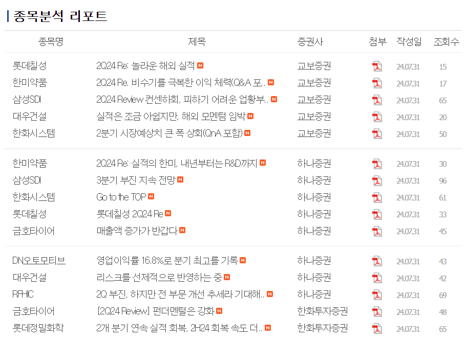
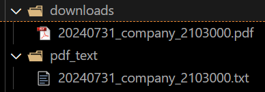
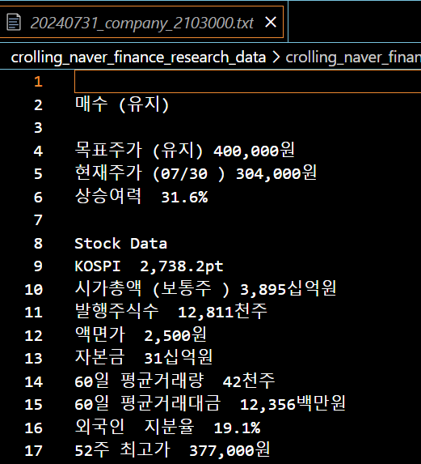
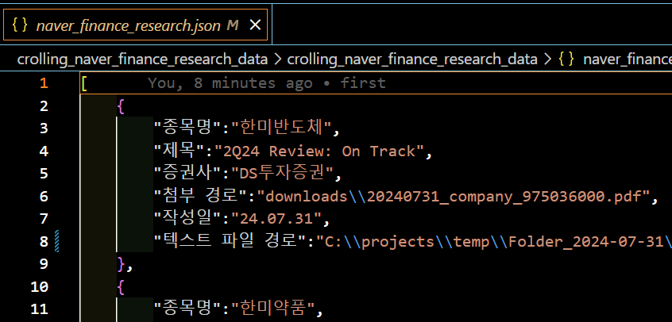

# 네이버 종목분석 리포트 추출   
[네이버 종목분석 리포트 사이트](https://finance.naver.com/research/company_list.naver)  
  

# start  
필수설치: `python` `poetry` `git`  

### 1. 깃 클론

```bash
git clone https://github.com/bamjun/crolling_naver_finance_research_data.git
```

### 2. 프로젝트 폴더로 이동  

```bash
cd crolling_naver_finance_research_data
```

### 3. poetry update (가상환경 설치)

```bash
poetry update
```

### 4. 가상환경 진입  

```bash
poetry shell
```

### 5. 파일실행  

```bash
cd crolling_naver_finance_research_data && python crolling_pdf_to_txt.py
```

  

  

  
